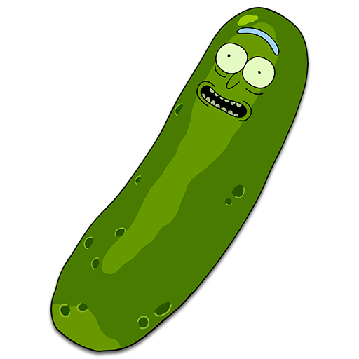
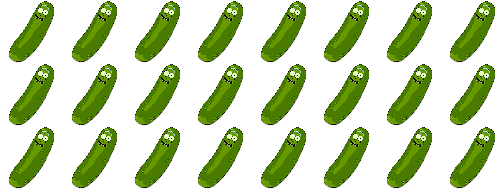
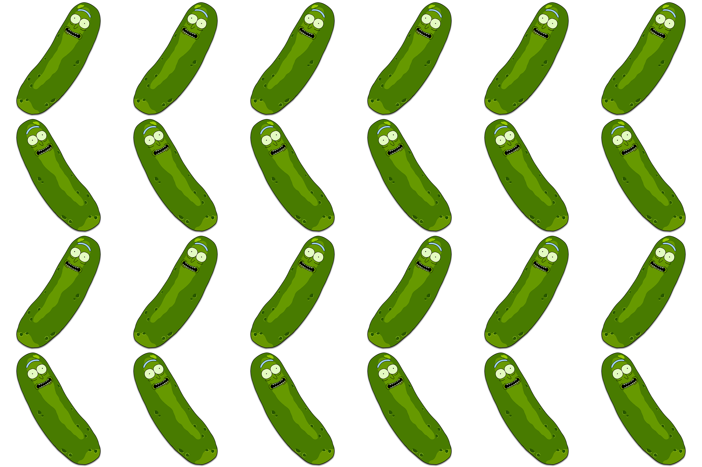
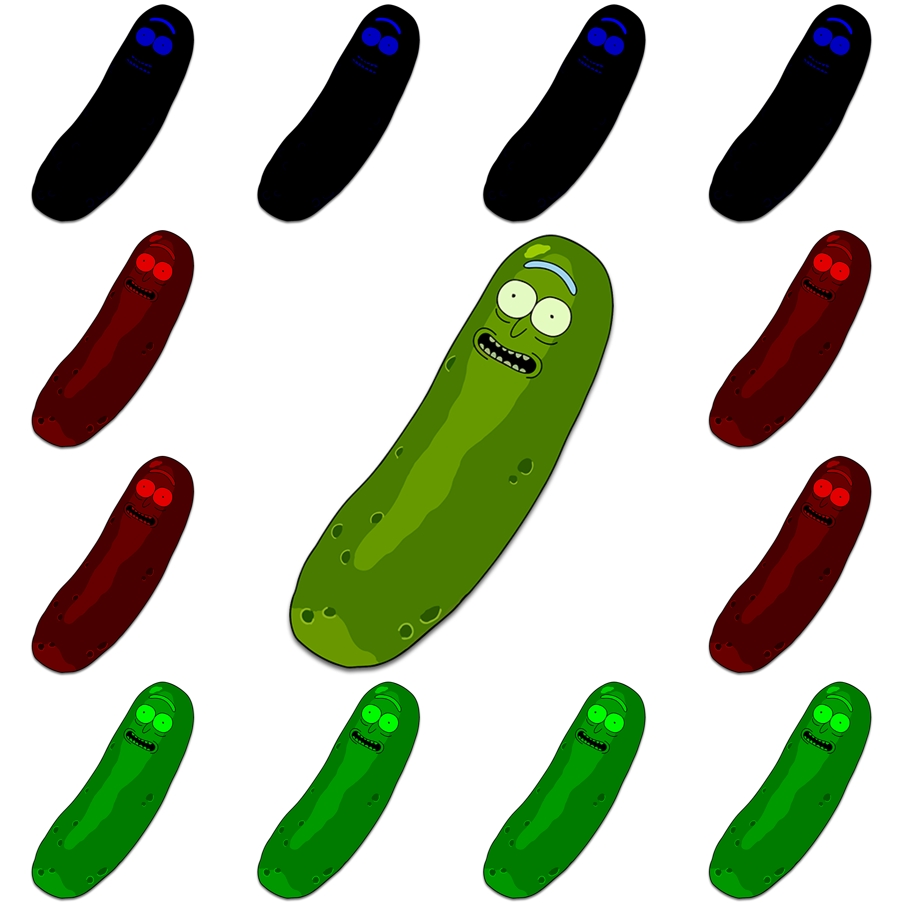
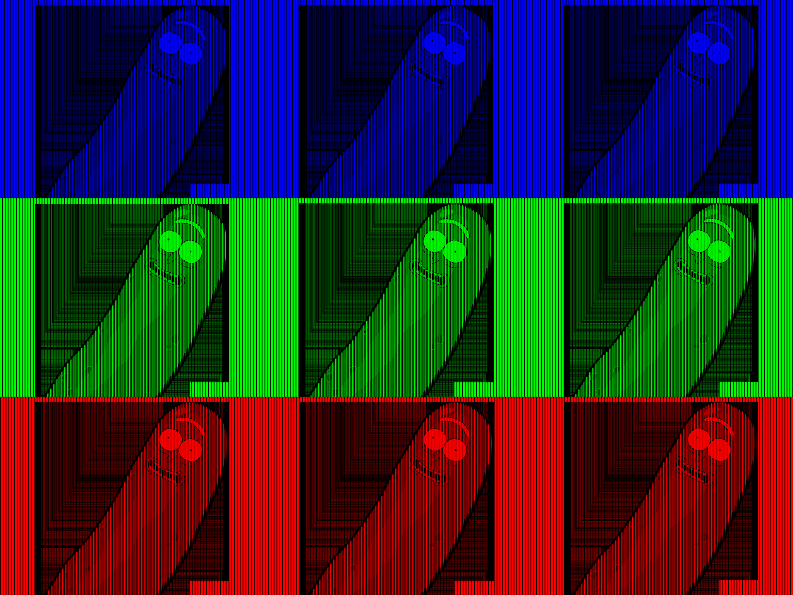
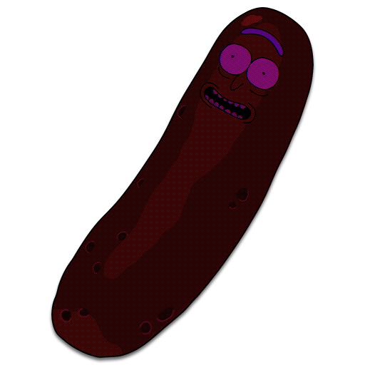

# Image Manipulation with Numpy

## Folder Structure

The project's folder structure is organized as follows:

- **data**: This directory contains two subdirectories, `input` and `output`, where input and output images are stored.
  - `input`: The directory where the image used for image manipulation exercises is.
  - 
  - `output`: The directory where the manipulated images are saved after each exercise.

- **docs**: This directory contains the assignment markdown file.

- **trials**: This directory contains code snippets and trial files created during the development process before creating the final image manipulation notebook.

- **image.yml**: This Conda environment file specifies the Python environment used for this project, including all the required dependencies.

- **final_image_manipulation.ipynb**: This Jupyter Notebook file is the combined iteration of all image manipulation exercises, providing a comprehensive overview of the entire process and showcasing the results of each exercise.

This organized folder structure helps maintain a clear separation of input, output, code trials, and documentation, making it easier to manage and reproduce the image manipulation tasks.

## The original image
Input: 

## Exercise 1: Tiling the Image
In this script, we demonstrate a simple yet effective image processing technique: tiling an image. The `load_and_tile_image` function is at the heart of this script. It begins by loading an image from a specified path and converting it to a NumPy array. The function then calculates the new dimensions based on the specified replication factors for vertical and horizontal repeats. Using NumPy's `np.tile`, it replicates the original image across these new dimensions. The final result is a visually appealing tiled pattern, which is then displayed and saved. This technique is useful in creating backgrounds or patterns from a single image.

Output: `tiled_pickle_rick.png`

## Exercise 2: Tiling and Mirroring
This script enhances the concept of tiling by adding an alternating mirroring effect. The `create_tiled_mirrored_image` function replicates the original image in a grid pattern, with an added twist: every alternate tile is mirrored. This is achieved by flipping the image array along the horizontal axis for every other tile. The result is a fascinating interplay of symmetry and pattern, showcasing the versatility of image manipulation with Python. This mirrored tiling effect can be particularly engaging for creating artistic interpretations or interesting backgrounds.

Output: `tiled_pickle_rick_mirrored.png`

## Exercise 3: Creating a Tiled Mosaic
The script focuses on creating a colorful mosaic by manipulating the color channels of each tile in a larger image. The `create_tiled_mosaic` function takes an original image and replicates it in a grid format. However, each tile undergoes a color alteration, emphasizing a different color channel (red, green, or blue). This process results in a vibrant mosaic where each tile contributes a unique color aspect to the overall image. Such a technique can be particularly useful in artistic projects or digital art, where color manipulation plays a crucial role in the aesthetic appeal.

Output: `pickle_rick_mosaic.png`

## Exercise 4: Creating a Warhol
This exercise explores the creation of a "Warhol"-esque effect by stacking different color-altered versions of the same image. The `alter_color` function manipulates specific color channels of an image, and the `stack_and_display` function then vertically stacks these altered images. This process results in a striking composition where each section of the stacked image displays a dominant color, reminiscent of Andy Warhol's famous pop art style. The final output showcases how simple color alterations can dramatically change the perception and impact of an image.

Output: `pickle_rick_warhol.png`

## Exercise 5: Adding Pixels and Alternate Color on Pixel Level
In this script, we delve into pixel-level manipulation to create a unique pattern across an image. The `alter_pixels` function takes an image and alternates the color alteration of each pixel between red and blue channels. This method creates a distinct and visually engaging pattern, highlighting the intricate control one can have at the pixel level. The alternating pattern adds a textured effect to the image, which can be useful in graphic designs or digital art to add depth or visual interest.

Output: `pickle_rick_altered_RGB.png`

